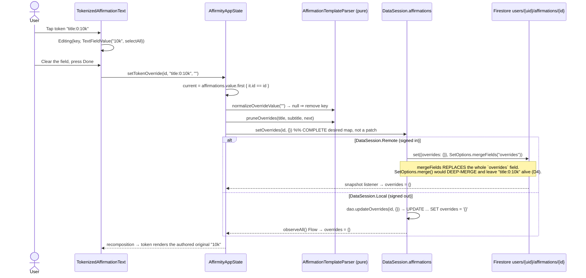

# Design: Customizable Affirmation Placeholders

## Technical Approach

Three layers, each with a hard boundary:

1. **Pure template layer** (`data/AffirmationTemplate.kt`) — a stdlib-only parser turning authored
   text into `List<TemplateSegment>` plus deterministic token keys, and resolving a template +
   override map into a rendered string. No Android, no Room, no Firebase. This is where every
   behavioral requirement of `specs/affirmation-placeholders/spec.md` actually lives, so it is
   fully unit-testable under `strict_tdd`.
2. **Persistence layer** — one additive `overrides: Map<String, String>` column on the existing
   `affirmations` table (`MIGRATION_6_7`, the codebase's first `@TypeConverter`) and one additive
   `overrides` field on `users/{uid}/affirmations/{id}`. Both are mutated through a single new
   symmetric repository method, `AffirmationRepository.setOverrides(id, overrides)`, with
   **whole-map replacement** semantics on both sides — so `DataSession`'s atomic Local/Remote swap
   keeps working unchanged.
3. **UI layer** — one new stateless composable, `TokenizedAffirmationText`, shared by
   `AffirmationCard` and `MyAffirmationsScreen`'s row. It renders one `Text` built from an
   `AnnotatedString` (tokens styled via `LinkAnnotation.Clickable`) and swaps the token under edit
   for an `InlineTextContent`-hosted `BasicTextField` — genuinely in-place, no dialog, no layout
   reflow of the surrounding sentence.

Satisfies `specs/affirmation-placeholders/spec.md` and the `data-sync` delta.

## Architecture Decisions

| Decision | Choice | Alternatives rejected | Rationale |
|---|---|---|---|
| **D1. Token identity** | Key = `"{field}:{ordinal}:{rawContent}"`, e.g. `title:0:10k` | Content-only key; independent stable UUID per token; character-offset key | Locked product decision #7 says an edit to a token's bracketed content DROPS its override — so identity *is* the literal content, and an independent stable ID would be actively wrong (it would survive an edit it must not survive). Ordinal disambiguates repeated content (`"[hoy] y [hoy]"`); the field prefix keeps `title` and `subtitle` token namespaces from colliding on one map. Character offsets were rejected: they shift on any surrounding-text edit, dropping overrides the product wants preserved. |
| **D2. Storage format = authored text; parse is a pure projection** | The `title`/`subtitle` columns keep storing raw bracket text. `parse()` is a deterministic pure function called at save time (to compute keys / prune) and memoized per composition via `remember(text)` at render time. The structured segment list is **never persisted**. | Persisting the parsed `List<TemplateSegment>` as a second column/field | Because D1 makes token keys a pure function of the authored string, a persisted segment list is a *derived projection*, not state. Persisting it creates a second source of truth that can drift from `title` — precisely the dual-source-of-truth bug class this repo already burned itself on (`TrackerPreferences`, cited in `firebase-migration/exploration.md`). It would also force a much larger schema change than the single `overrides` column the proposal scoped. This refines the spec's "performed once at save/import time" wording: the *parse-once* guarantee it is really asking for is **stable-by-construction identity**, which this delivers, plus the spec's own "re-derivable via a pure parser" clause. Behavior is identical; storage is smaller and cannot drift. |
| **D3. Parser grammar** | `Regex("""\[([^\[\]]*)\]""")`, left-to-right, non-overlapping. An unpaired `[` or `]` stays literal. A `[]` with blank content is emitted as a **literal** `[]`, not a token. | `\[([^\]]*)\]` (greedy across nested `[`); a hand-rolled state machine | Excluding both bracket chars from the content class makes `"[a[b]"` resolve unambiguously (literal `[a`, token `b`) instead of producing a token whose content contains a `[`. Blank tokens are demoted to literals because an empty tappable chip has no hit target and no meaningful default value. Content is captured **verbatim** (not trimmed) — trimming would silently change both the rendered default and the key. |
| **D4. Firestore write path** | `set(mapOf("overrides" to map), SetOptions.mergeFields("overrides"))` — see "Risk 1" below | `SetOptions.merge()`; `FieldValue.delete()` per removed key; `update()` | `merge()` deep-merges nested map values, so writing a map with a key removed leaves the old key alive on the server — the exact silent-resurrection bug. `mergeFields` sets the listed field path wholesale. `update()` has the same replace semantics but throws if the document does not exist (a catalog affirmation the user has never written to). Per-key `FieldValue.delete()` needs the app to know which keys the *server* holds, which it does not. |
| **D5. `insert()` also switches to `mergeFields`** | `FirestoreAffirmationRepository.insert` uses `SetOptions.mergeFields(*AFFIRMATION_FIELDS)` instead of `SetOptions.merge()` | Leave `insert` on `merge()`; drop merge entirely (`set(map)`) | Now that `affirmationToMap` carries a nested map, plain `merge()` makes *every* affirmation write deep-merge-unsafe, not just the override path. Listing all seven known fields keeps the write idempotent/retry-safe (the reason `merge()` was chosen originally) while giving `overrides` replace semantics on every code path. Bare `set(map)` was rejected because it would also blow away unknown future fields. |
| **D6. Room whole-column write** | `@Query("UPDATE affirmations SET overrides = :overrides WHERE id = :id")` — Room applies the `TypeConverter` to the query argument | `@Update` on the whole entity; `@Insert(onConflict = REPLACE)` | Symmetric with D4 (one field replaced, nothing else touched), and it does not require the caller to hold a complete `AffirmationEntity` just to change one map. `INSERT OR REPLACE` was rejected: it deletes-then-inserts, which changes `rowid` and would silently reorder the feed (`observeAll()` is `ORDER BY rowid ASC`). |
| **D7. Serialization for the converter** | Deterministic hand-built JSON object over `toSortedMap()`, escaped with `org.json.JSONObject.quote`; parsed back with `JSONObject` | `kotlinx.serialization`; `JSONObject(map).toString()`; delimiter-joined string | No new Gradle dependency: `org.json` is already a production dependency of this module (`AffirmationImport.kt`) and is already wired for JVM unit tests via `testImplementation(libs.json)`. `kotlinx.serialization` would add a plugin + runtime for one `Map<String, String>`. `JSONObject(map).toString()` has non-deterministic key order (backing `HashMap`), which makes exact-string unit assertions flaky — sorting keys ourselves makes the column value canonical and diffable. A delimiter-joined format would need its own escaping story. |
| **D8. Override mutation is read-modify-write from the observed snapshot** | `AffirmityAppState.setTokenOverride` reads the current `Affirmation` from the already-collected `affirmations` state, applies put/remove, prunes, and writes the full map | A Firestore transaction; a server-side `FieldValue` map patch | Whole-map replacement is last-writer-wins at affirmation granularity. Two devices editing *different* tokens of the *same* affirmation within one sync window will lose one edit. Accepted: this is single-user personal data on one affirmation at a time, and a transaction would add a round-trip and a Firestore-only code path that Room could not mirror — breaking the symmetric-repository constraint. |
| **D9. Rendering primitive** | One `Text` with an `AnnotatedString`: literal segments plain, token segments wrapped in `withLink(LinkAnnotation.Clickable(tokenKey, styles = TextLinkStyles(SpanStyle(...))))`; the token under edit is emitted as `appendInlineContent(tokenKey)` backed by an `InlineTextContent` hosting a `BasicTextField` | `FlowRow` of `Text` + `TextField` chips; `ClickableText` + `onTextLayout` offset hit-testing; tap opens an `AlertDialog`/`ModalBottomSheet` | A `FlowRow` destroys the card's centered multi-line typography (line breaking would happen at segment boundaries, not word boundaries) — a visible regression on affirmations with no tokens. `ClickableText` is deprecated in this Compose version, and manual offset hit-testing re-implements what `LinkAnnotation.Clickable` provides for free including accessibility. A dialog is the easy path but violates the spec's "inline input" and the product intent of editing the sentence you are reading. |
| **D10. Single active editor** | One nullable `editingTokenKey: String?` per rendered affirmation; tapping a second token commits the first | Multiple simultaneous inline fields | Removes the entire class of "which field owns focus / which commits first" bugs, and matches the physical reality of one soft keyboard. |
| **D11. Blur, IME-Done and system-Back all COMMIT** | Every exit path commits; there is no cancel | Back = cancel | Commit-on-blur is required by the spec's interaction; having Back mean the opposite of blur is the kind of inconsistency users only discover by losing input. Commit is non-destructive here: empty always reverts to the original, and the token is always re-editable. |
| **D12. Both surfaces are editable** | `TokenizedAffirmationText(editable = true)` in `AffirmationCard` **and** in `MyAffirmationsScreen`'s `AffirmationRow` | Card editable, list row read-only-styled | The spec's "Tap-to-Edit Inline Input" requirement is not surface-qualified, and the styling-consistency scenario names both surfaces. Same composable, one flag, near-zero extra cost. Tradeoff noted: the management row is dense and sits next to a delete icon — if UX review dislikes it, flipping `editable = false` there is a one-line change that still satisfies the styling requirement. |
| **D13. No entitlement check anywhere on this path** | `setTokenOverride` has no `AccessDecision` guard, no analytics gate event | Mirror `addAffirmationWith*`'s `customAffirmationCreateDecision` guard | Locked product decision #5. Called out explicitly because every *other* affirmation write in `AffirmityAppState` starts with an entitlement guard, so the omission must read as deliberate, not forgotten. |
| **D14. Overrides are never logged** | Token keys and override values MUST NOT appear in any `AnalyticsEvent` | Emit a `token_override_set` event with the value | Override values are free-text user input and are therefore PII-representable; the analytics capability already carries a structural no-PII invariant (REQ-6.3.2). No analytics requirement exists for this change, so the safest design is no event at all. |
| **D15. Override value length cap** | `MAX_OVERRIDE_VALUE_LENGTH = 120`, enforced at commit in the pure layer | Uncapped | A single unbounded value repeated across tokens is the only realistic way this feature can bloat a Firestore document or a Room row. 120 chars comfortably exceeds any sane placeholder ("10k", "dolares", "mes"). |

## Interfaces / Contracts

### Pure template layer — `data/AffirmationTemplate.kt` (new)

```kotlin
/** Which authored field a token came from — keeps title/subtitle key namespaces disjoint (D1). */
enum class TemplateField(val prefix: String) { TITLE("title"), SUBTITLE("subtitle") }

sealed interface TemplateSegment {
    data class Literal(val text: String) : TemplateSegment
    /** [key] is stable-by-construction (D1); [original] is the verbatim bracketed content. */
    data class Token(val key: String, val original: String) : TemplateSegment
}

data class AffirmationTemplate(val field: TemplateField, val segments: List<TemplateSegment>) {
    val tokenKeys: List<String> get() = segments.filterIsInstance<TemplateSegment.Token>().map { it.key }

    /** Effective value for a token: override if present and non-blank, else the authored original. */
    fun valueOf(token: TemplateSegment.Token, overrides: Map<String, String>): String =
        overrides[token.key]?.takeIf { it.isNotBlank() } ?: token.original

    /** Flat rendered text. `render(emptyMap())` yields the original values with brackets stripped. */
    fun render(overrides: Map<String, String>): String
}

const val MAX_OVERRIDE_VALUE_LENGTH = 120

object AffirmationTemplateParser {
    fun parse(field: TemplateField, text: String): AffirmationTemplate

    fun tokenKey(field: TemplateField, ordinal: Int, original: String): String =
        "${field.prefix}:$ordinal:$original"

    /** Drops override keys with no matching token in the current text (D1 / locked decision #7). */
    fun pruneOverrides(title: String, subtitle: String, overrides: Map<String, String>): Map<String, String>

    /** Commit-time normalization: trims, drops blanks, enforces [MAX_OVERRIDE_VALUE_LENGTH]. */
    fun normalizeOverrideValue(raw: String): String?   // null == remove the override
}
```

Invariants the unit tests pin down:

- `parse(f, t).render(emptyMap())` equals `t` with all bracket pairs stripped; for text with no
  bracket pair it equals `t` **exactly**, and `segments` is a single `Literal` (spec: byte-for-byte
  identical plain rendering).
- Unknown override keys are ignored by `valueOf`/`render` and never throw (spec: unmatched keys
  never crash).
- A blank or whitespace-only override value never wins over the original.

### Persistence — Room

```kotlin
// data/local/AffirmationEntity.kt (modified)
@Entity(tableName = "affirmations")
data class AffirmationEntity(
    @PrimaryKey val id: String,
    val title: String,
    val subtitle: String,
    val backgroundType: String,
    val backgroundValue: String,
    @ColumnInfo(defaultValue = PERSONALIZADAS_GROUP_ID)
    val groupId: String = PERSONALIZADAS_GROUP_ID,
    @ColumnInfo(defaultValue = "{}")
    val overrides: Map<String, String> = emptyMap(),
)

// data/local/OverridesConverters.kt (new) — the codebase's first TypeConverter (D7)
class OverridesConverters {
    @TypeConverter
    fun fromOverrides(value: Map<String, String>?): String =
        value.orEmpty().toSortedMap().entries.joinToString(
            separator = ",", prefix = "{", postfix = "}",
        ) { (k, v) -> "${JSONObject.quote(k)}:${JSONObject.quote(v)}" }

    @TypeConverter
    fun toOverrides(value: String?): Map<String, String> = runCatching {
        val obj = JSONObject(value.orEmpty().ifBlank { "{}" })
        obj.keys().asSequence().mapNotNull { k -> obj.optString(k).takeIf { it.isNotBlank() }?.let { k to it } }.toMap()
    }.getOrDefault(emptyMap())   // malformed column content degrades to "no overrides", never crashes
}

// data/local/AffirmationDao.kt (modified) — the DAO's first update (D6)
@Query("UPDATE affirmations SET overrides = :overrides WHERE id = :id")
suspend fun updateOverrides(id: String, overrides: Map<String, String>)
```

`@TypeConverters(OverridesConverters::class)` is registered on the `AffirmityDatabase` class
(database scope, so the converter also applies to the `updateOverrides` query argument).

### Persistence — migration

```kotlin
/** Additive, mirrors MIGRATION_4_5 exactly. The NOT NULL DEFAULT '{}' backfills every pre-existing
 * row with an empty override map in one statement, so no affirmation can become unreadable by the
 * new TypeConverter (which would otherwise see NULL). No content is inserted or altered. */
val MIGRATION_6_7 = object : Migration(6, 7) {
    override fun migrate(db: SupportSQLiteDatabase) {
        db.execSQL("ALTER TABLE `affirmations` ADD COLUMN `overrides` TEXT NOT NULL DEFAULT '{}'")
    }
}
```

`version = 7`, and `MIGRATION_6_7` appended to the existing `addMigrations(...)` chain.

### Persistence — Firestore

```kotlin
// data/remote/FirestoreMappers.kt (modified) — still pure, still unit-tested directly
const val FIELD_OVERRIDES = "overrides"

/** Every known field on an affirmation doc — the mergeFields allow-list for writes (D5). */
val AFFIRMATION_FIELDS = arrayOf(
    FIELD_ID, FIELD_TITLE, FIELD_SUBTITLE, FIELD_BACKGROUND_TYPE,
    FIELD_BACKGROUND_VALUE, FIELD_GROUP_ID, FIELD_OVERRIDES,
)

fun affirmationToMap(entity: AffirmationEntity): Map<String, Any> = mapOf(
    /* ...existing six fields unchanged... */
    FIELD_OVERRIDES to sanitizedOverrides(entity.overrides),
)

fun affirmationFromMap(map: Map<String, Any?>): AffirmationEntity = AffirmationEntity(
    /* ...existing five fields unchanged... */
    groupId = map[FIELD_GROUP_ID] as? String ?: PERSONALIZADAS_GROUP_ID,
    // Legacy docs written before this change have no `overrides` field -> empty map, never null.
    overrides = (map[FIELD_OVERRIDES] as? Map<*, *>)
        ?.mapNotNull { (k, v) -> (k as? String)?.let { key -> (v as? String)?.takeIf(String::isNotBlank)?.let { key to it } } }
        ?.toMap()
        .orEmpty(),
)

/** Never persists a blank value (spec: "no empty override MUST be persisted"). */
private fun sanitizedOverrides(overrides: Map<String, String>): Map<String, String> =
    overrides.filterValues { it.isNotBlank() }

/**
 * Whole-field replacement payload for the overrides map. MUST be written with
 * `SetOptions.mergeFields(FIELD_OVERRIDES)` -- plain `SetOptions.merge()` deep-merges nested maps
 * and would silently resurrect a deleted override key (D4). The field is always PRESENT (possibly
 * as an empty map), never omitted, so "delete every override" is an explicit, testable write.
 */
fun overridesWritePayload(overrides: Map<String, String>): Map<String, Any> =
    mapOf(FIELD_OVERRIDES to sanitizedOverrides(overrides))
```

### Repository contract — symmetric across `DataSession.Local` and `.Remote`

```kotlin
// data/repository/Repositories.kt (modified)
interface AffirmationRepository {
    fun observeAll(): Flow<List<AffirmationEntity>>
    suspend fun insert(entity: AffirmationEntity)
    suspend fun deleteById(id: String)
    suspend fun deleteAll()
    /**
     * Replaces the ENTIRE override map for [id] with [overrides]. Whole-map replacement, not a
     * patch: a key absent from [overrides] is deleted from the store. Callers pass the complete
     * desired map (D8). A blank value is never persisted.
     */
    suspend fun setOverrides(id: String, overrides: Map<String, String>)
}

// RoomAffirmationRepository
override suspend fun setOverrides(id: String, overrides: Map<String, String>) =
    dao.updateOverrides(id, overrides.filterValues { it.isNotBlank() })

// FirestoreAffirmationRepository
override suspend fun setOverrides(id: String, overrides: Map<String, String>) {
    collection().document(id)
        .set(overridesWritePayload(overrides), SetOptions.mergeFields(FIELD_OVERRIDES))
        .await()
}
```

Both sides replace one field wholesale and touch nothing else, so `DataSession`'s atomic
Local/Remote swap keeps its "a bundle is never half-swapped" property with no change to
`DataSession` itself.

### Domain + app state

```kotlin
// data/AffirmityAppState.kt (modified)
data class Affirmation(
    val id: String = UUID.randomUUID().toString(),
    val title: String,
    val subtitle: String,
    val background: AffirmationBackground,
    val groupId: String = PERSONALIZADAS_GROUP_ID,
    val overrides: Map<String, String> = emptyMap(),
)

/** No entitlement guard by design (D13): placeholder editing is free for all users. */
fun setTokenOverride(affirmationId: String, tokenKey: String, rawValue: String) {
    scope.launch {
        val current = affirmations.value.firstOrNull { it.id == affirmationId } ?: return@launch
        val next = current.overrides.toMutableMap().apply {
            when (val v = AffirmationTemplateParser.normalizeOverrideValue(rawValue)) {
                null -> remove(tokenKey)   // empty input == revert to the authored original
                else -> put(tokenKey, v)
            }
        }
        ready().affirmations.setOverrides(
            affirmationId,
            AffirmationTemplateParser.pruneOverrides(current.title, current.subtitle, next),
        )
    }
}
```

`toEntity()`/`toAffirmation()` carry `overrides` through 1:1. `pruneOverrides` is also applied on
the user-affirmation text-edit path, which is what actually executes locked decision #7.

### UI — `ui/affirmations/TokenizedAffirmationText.kt` (new)

```kotlin
@Composable
fun TokenizedAffirmationText(
    template: AffirmationTemplate,
    overrides: Map<String, String>,
    style: TextStyle,
    color: Color,
    tokenStyle: SpanStyle,          // background + bold + underline; one definition, both surfaces
    editable: Boolean,
    onOverrideCommitted: (tokenKey: String, value: String) -> Unit,
    textAlign: TextAlign? = null,
    modifier: Modifier = Modifier,
)
```

Callers memoize the parse: `val template = remember(affirmation.title) { AffirmationTemplateParser.parse(TITLE, affirmation.title) }`.

**Edit state machine** (local to the composable, `remember`ed, single active editor per D10):

```
Idle
  │  tap token k                       (LinkAnnotation.Clickable handler)
  ▼
Editing(key = k, value = TextFieldValue(text = valueOf(k), selection = SelectAll))
  │  onValueChange                     → Editing(k, newValue)
  │  IME Done                          → commit(k) → Idle
  │  focus lost (blur / swipe / sheet) → commit(k) → Idle
  │  system Back (BackHandler)         → commit(k) → Idle          (D11)
  │  tap another token k2              → commit(k) → Editing(k2, …)
  ▼
commit(k):
  raw = value.text
  if (normalize(raw) == overrides[k]) → no-op          // idempotent, avoids a pointless write
  else onOverrideCommitted(k, raw)                     // blank raw ⇒ app state removes the key
```

Mechanics:

- The token under edit is emitted as `appendInlineContent(id = k, alternateText = value.text)` with
  `Placeholder(width = (value.text.length + 1).coerceAtLeast(3) * 0.62f em, height = 1.35 em,
  PlaceholderVerticalAlign.Center)`. Width is recomputed on every keystroke, so the field grows as
  the user types. The `0.62 em` factor is a proportional-font approximation — it is an intentional
  visual approximation, not a correctness concern, and is isolated in one private constant
  (`TOKEN_FIELD_EM_PER_CHAR`) so it can be tuned without touching logic.
- The inline content hosts a `BasicTextField(singleLine = true, textStyle = style.merge(tokenStyle),
  keyboardOptions = KeyboardOptions(imeAction = ImeAction.Done), keyboardActions =
  KeyboardActions(onDone = { commit() }))` plus `Modifier.focusRequester(fr).onFocusChanged { ... }`.
- `LaunchedEffect(editingKey) { fr.requestFocus() }` and the initial `selection = TextRange(0, len)`
  give the spec's "pre-filled with the current effective value" while letting the user type over it
  immediately.
- `AffirmationCard`'s content `Column` gains `Modifier.imePadding()` so the soft keyboard cannot
  cover the field being edited inside the full-screen `VerticalPager`. The pager stays scrollable
  during an edit — a swipe blurs the field, which commits (D11), which is the desired outcome.

`MyAffirmationsScreen.AffirmationRow` uses the same composable with `editable = true` (D12) and the
same `tokenStyle`, satisfying the spec's cross-surface styling-consistency scenario by construction.

## Data Flow

### Override write — the delete-must-propagate path



### Render / resolve

```
AffirmationEntity.title ──parse(TITLE, text)──▶ AffirmationTemplate (remember(text))
                                                        │
AffirmationEntity.overrides ────────────────────────────┤
                                                        ▼
                              valueOf(token, overrides) per token segment
                                    │ override present & non-blank → override
                                    │ key unknown / blank / absent  → token.original
                                    ▼
                          AnnotatedString  (Literal → plain · Token → tokenStyle + Clickable)
```

## File Changes

| File | Action | Description |
|---|---|---|
| `data/AffirmationTemplate.kt` | Create | `TemplateField`, `TemplateSegment`, `AffirmationTemplate`, `AffirmationTemplateParser` (parse / `tokenKey` / `pruneOverrides` / `normalizeOverrideValue`), `MAX_OVERRIDE_VALUE_LENGTH`. Pure stdlib. |
| `data/local/OverridesConverters.kt` | Create | First `@TypeConverter` in the codebase; deterministic sorted-key JSON via `org.json` (D7). |
| `data/local/AffirmationEntity.kt` | Modify | `overrides: Map<String, String> = emptyMap()` + `@ColumnInfo(defaultValue = "{}")`. |
| `data/local/AffirmityDatabase.kt` | Modify | `version = 7`, `@TypeConverters(OverridesConverters::class)`, `MIGRATION_6_7`, appended to `addMigrations(...)`. |
| `data/local/AffirmationDao.kt` | Modify | `updateOverrides(id, overrides)` — the DAO's first update query (D6). |
| `data/repository/Repositories.kt` | Modify | `AffirmationRepository.setOverrides(id, overrides)`. |
| `data/repository/RoomAffirmationRepository.kt` | Modify | Delegate `setOverrides` → `dao.updateOverrides`. |
| `data/remote/FirestoreMappers.kt` | Modify | `FIELD_OVERRIDES`, `AFFIRMATION_FIELDS`, `sanitizedOverrides`, `overridesWritePayload`; `affirmationToMap`/`FromMap` carry overrides with a legacy-doc-safe read. |
| `data/remote/FirestoreAffirmationRepository.kt` | Modify | `setOverrides` via `mergeFields(FIELD_OVERRIDES)` (D4); `insert` switches to `mergeFields(*AFFIRMATION_FIELDS)` (D5). |
| `data/AffirmityAppState.kt` | Modify | `Affirmation.overrides`; `toEntity`/`toAffirmation` carry it; `setTokenOverride(...)` (no entitlement guard, D13); `pruneOverrides` on the user text-edit path. |
| `data/AffirmationImport.kt` | Modify | KDoc documenting bracket syntax for authors (no `ParsedAffirmation` shape change — imports carry defaults only, never overrides). |
| `ui/affirmations/TokenizedAffirmationText.kt` | Create | Shared render + inline-edit composable, `tokenStyle` definition, edit state machine (D9–D11). |
| `ui/affirmations/AffirmationsScreen.kt` | Modify | `AffirmationCard` renders title/subtitle through `TokenizedAffirmationText`; `imePadding()` on the content column; new `onOverrideCommitted` param threaded from `MainActivity`. |
| `ui/myaffirmations/MyAffirmationsScreen.kt` | Modify | `AffirmationRow` uses `TokenizedAffirmationText` (D12); `AFFIRMATIONS_JSON_EXAMPLE` gains a `[token]` example. |
| `MainActivity.kt` | Modify | Wire `appState::setTokenOverride` into both screens. |
| `app/src/test/.../data/AffirmationTemplateTest.kt` | Create | Parser + resolution + prune + normalize (TDD-first). |
| `app/src/test/.../data/local/OverridesConvertersTest.kt` | Create | Round-trip, determinism, malformed input, blank filtering. |
| `app/src/test/.../data/remote/FirestoreMappersTest.kt` | Modify | Overrides round-trip, legacy doc without the field, `overridesWritePayload` shape. |
| `app/src/test/.../data/remote/MigrationPlanTest.kt` | Modify | Overrides carried into the migration `DocWrite`. |
| `app/schemas/…/7.json` | Create (generated) | Room exported schema for version 7. |
| `app/src/androidTest/.../AffirmityDatabaseMigrationTest.kt` | Modify | `MIGRATION_6_7` coverage: existing rows survive, `overrides` backfills to `'{}'`. |

## Testing Strategy

| Layer | What to test | Approach |
|---|---|---|
| Unit (`gradlew.bat testDebugUnitTest`) | **Parser**: alternating segments in source order; no-bracket text → single `Literal` and byte-identical `render(emptyMap())`; unpaired `[`/`]` stays literal; `[a[b]` → literal `[a` + token `b`; `[]` demoted to literal; verbatim (untrimmed) content; key format `field:ordinal:content`; repeated identical content gets distinct ordinals; title and subtitle keys never collide. | JUnit 4, pure Kotlin, zero Android — the parser has no platform dependency by construction (D2). |
| Unit | **Resolution**: override applied; blank override loses to the original; unknown key ignored without throwing; `render(emptyMap())` == original values (the widget/notification contract). | Same. |
| Unit | **Prune / locked decision #7**: `[10k]` → `[20k]` edit drops the `title:0:10k` key; surrounding-text-only edit **keeps** it; a token inserted before shifts ordinals and drops downstream keys. | Same. Encodes the drift semantics as executable spec. |
| Unit | **Converter**: round-trip; deterministic sorted output for two maps built in different insertion orders; keys/values containing `"`, `\`, `{`, `:` survive; `null`/`""`/`"garbage"` → `emptyMap()`; blank values filtered. | `org.json` is already on the unit-test classpath (`testImplementation(libs.json)`), same as `AffirmationImport`'s existing tests. |
| Unit | **Firestore mapper**: `affirmationToMap` includes `overrides`; blank values never emitted; `affirmationFromMap` on a legacy doc with no `overrides` → `emptyMap()`; non-string map values ignored; `overridesWritePayload(emptyMap())` yields the field **present and empty**, never absent. | Pure mappers, per this repo's existing "logic in `FirestoreMappers`, glue untested" convention. |
| Unit | **MigrationPlan**: an affirmation with overrides produces a `DocWrite` carrying them. | Existing `MigrationPlanTest` pattern. |
| Integration | N/A (`config.yaml`: unavailable). | — |
| E2E (`gradlew.bat connectedDebugAndroidTest`) | `MIGRATION_6_7`: a v6 DB with rows migrates to v7 with every row's `overrides` == `'{}'` and no other column altered. Optionally a Compose UI test: tap token → field appears pre-filled → type → Done → rendered text updates. | `androidx-room-testing` `MigrationTestHelper` against `app/schemas`, as the existing migration test already does. |
| **Manual / emulator (cannot be JVM-tested)** | **`SetOptions.mergeFields` deletion propagation** — the single highest-risk assumption in this design. Set an override on device A, delete it, confirm device B's snapshot listener reports an `overrides` map without the key. | Firestore emulator or two signed-in devices. `sdd-tasks` MUST carry this as an explicit verification task; a green unit suite does not prove it. |

## Threat Matrix

No routing, shell, subprocess, VCS/PR automation, or executable-file classification boundary is
introduced. Two data-handling notes:

- **Injection**: override values are free-text and are rendered into a Compose `Text`, which does
  not interpret markup — there is no HTML/markdown/format-string surface. Values reach SQLite only
  through a bound `@Query` parameter and Firestore only as a typed map value; neither concatenates.
- **Blast radius / quota**: overrides live under `users/{uid}/affirmations/{id}`, already covered by
  the existing per-uid security rules — no rules change is needed. Growth is bounded by
  `MAX_OVERRIDE_VALUE_LENGTH` (D15) times the token count of the affirmation's own text.
- **Privacy**: override values are user-authored personal content and are never logged, never sent
  to analytics (D14), and never leave the user's own Firestore namespace.

## Migration / Rollout

**Room 6 → 7.** Additive `ALTER TABLE ... ADD COLUMN overrides TEXT NOT NULL DEFAULT '{}'`, the same
shape as the proven `MIGRATION_4_5`. Every pre-existing row is backfilled in one statement, so the
new `TypeConverter` never sees `NULL`. `exportSchema = true` means `app/schemas/7.json` must be
generated and committed, and the `androidTest` migration test must be extended before merge.

**Room downgrade — explicitly an accepted risk, not solved.** Room rejects opening a database whose
on-disk version is higher than the compiled version, and this app does **not** enable
`fallbackToDestructiveMigrationOnDowngrade` (enabling it would silently wipe every affirmation,
completion, mood and healer row — categorically worse than the problem). This design therefore
**does not ship a `7 → 6` migration**, resolving the proposal's open Rollback-Plan item #2 in the
negative: a `7 → 6` down-migration would have to drop the column and would destroy every override,
so it buys nothing a fresh install does not. Consequences, accepted:

- Pre-release rollback is free: revert the branch, nothing shipped.
- Post-release rollback for an already-migrated device is **not supported**; the recovery path is a
  forward fix, or the partial rollback below.
- **Partial rollback (the real lever)**: keep schema version 7 and set a single constant
  (`AffirmationTemplateParser` returns a single `Literal` unconditionally). Every affirmation then
  renders as plain authored text including brackets, no token is tappable, and no override is read
  or written — while the persisted data stays intact for a later re-enable.

**Firestore.** The `overrides` field is additive and ignored by pre-change mappers, so a
mixed-version fleet is safe in both directions and no backfill or data deletion is required.
`FirestoreMigrator.commitChunk` keeps using plain `SetOptions.merge()` unchanged: the one-time
migration only runs when `users/{uid}/meta/migrated` does **not** exist, so its target documents
cannot pre-exist and deep-merge resurrection is structurally impossible on that path. Only the
steady-state write path needs `mergeFields`.

**Widget / notifications.** Verified during design: no current surface renders affirmation text.
`WeeklyTrackerWidget` renders only tracker dots, and notification copy comes from the FCM payload /
`ReflectionPromptProvider`, not from `AffirmationEntity`. The spec's "widget shows original token
values" requirement is therefore satisfied vacuously today. `AffirmationDao.randomAffirmation()`
exists but currently has **no callers** — it is the latent surface. Guardrail for any future
consumer: render through `AffirmationTemplateParser.parse(field, text).render(emptyMap())`, which
strips brackets and yields the authored originals. Rendering `entity.title` raw from a new surface
would leak literal `[` `]` to users.

## Open Questions

- [ ] **`SetOptions.mergeFields` nested-map replacement must be empirically confirmed.** This design
      asserts that listing a top-level field in `mergeFields` replaces that field's value wholesale
      rather than deep-merging its nested map. It is the load-bearing assumption of D4 and no JVM
      unit test can prove it. `sdd-tasks` MUST include an emulator/two-device verification task. If
      it turns out `mergeFields` also deep-merges, the fallback is a two-step write —
      `update(FIELD_OVERRIDES, FieldValue.delete())` followed by the `mergeFields` set — or
      `set(affirmationToMap(entity))` with no merge option at all, at the cost of losing
      unknown-field preservation.
- [ ] **`Placeholder` width heuristic (`TOKEN_FIELD_EM_PER_CHAR = 0.62`).** `InlineTextContent`
      requires an up-front width; proportional fonts make any per-character estimate approximate, so
      the inline field will be slightly wider or narrower than its content. Needs one visual pass on
      device. If it reads badly, the escape hatch is a fixed-width field sized to the longer of the
      original and the current value.
- [ ] **Is the `MyAffirmationsScreen` row the right place to edit?** D12 makes it editable for
      strict spec conformance, but it is a dense management list next to a delete icon. Flag for UX
      review; flipping `editable = false` there is one line and still satisfies the styling
      requirement.
- [ ] **Ordinal-based identity vs. token insertion.** Inserting a *new* token before an existing one
      shifts every downstream ordinal and drops those overrides. This is consistent with locked
      decision #7's "no remapping" spirit and with the spec's "position and bracketed text" wording,
      but it is a slightly wider drop than a naive reading of #7 (which only mentions content
      changes). Confirm this is acceptable — content-only keys would avoid it but could not
      disambiguate repeated tokens.
