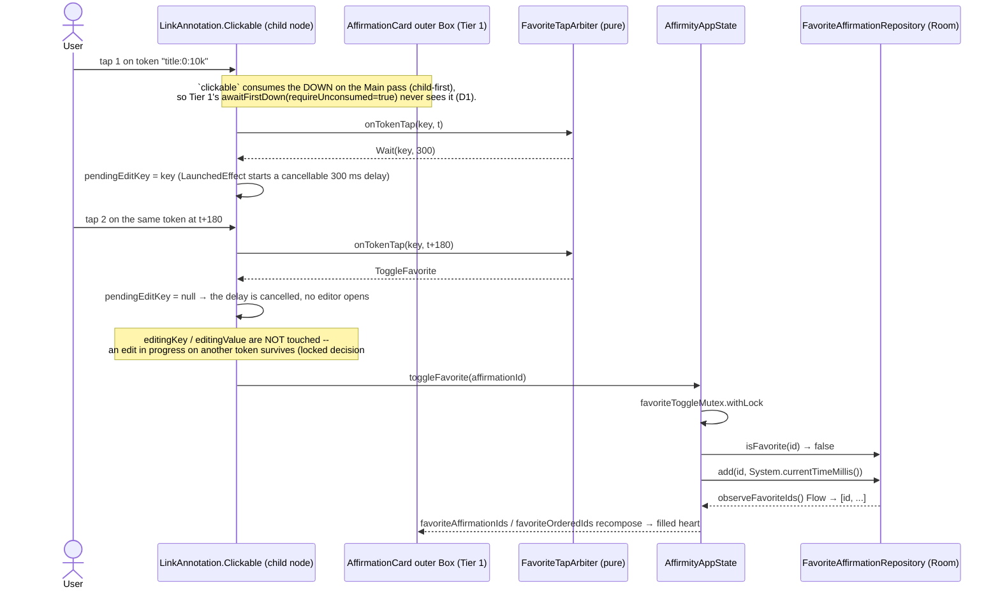

# Design: Favorite Affirmations

## Technical Approach

Four layers, each with a hard boundary:

1. **Pure gesture-arbitration layer** (`ui/affirmations/FavoriteTapArbiter.kt`) — a stdlib-only
   state machine that turns a stream of `(tokenKey, timestampMillis)` tap events into one of three
   decisions: `StartEditing`, `ToggleFavorite`, or `Wait`. No Android, no Compose. This is where
   the "double-tap wins over the token's single-tap-to-edit" rule actually lives, so the *rule* is
   JVM-unit-testable even though the *gesture plumbing* is not.
2. **Persistence layer** — a new standalone `favorite_affirmations` table (`affirmationId` PK,
   `favoritedAtMillis`), additive `MIGRATION_7_8`, mirroring the proven `ad_unlock` /
   `daily_completion` standalone-table shape. **Device-local only**: it is deliberately *not*
   bundled into `DataSession` (see D4).
3. **App-state layer** — `AffirmityAppState` gains `favoriteAffirmationIds` (O(1) membership),
   `favoriteAffirmations` (a derived list, recency-ordered), `toggleFavorite(id)`, and a cascade
   delete inside the two existing affirmation-deletion paths.
4. **UI layer** — a two-tier tap partition on `AffirmationCard` (D1) plus a new stateless
   `ui/favorites/FavoritesScreen.kt` rendered as a `Scaffold` + `BackHandler` overlay, byte-for-byte
   the `showMyAffirmations` pattern already in `MainActivity.kt`.

Satisfies `specs/affirmation-favorites/spec.md`. No `data-sync` delta: nothing is written remotely.

## Architecture Decisions

| Decision | Choice | Alternatives rejected | Rationale |
|---|---|---|---|
| **D1. Gesture arbitration = two-tier tap partition, not parent interception** | Tier 1 (card body): `Modifier.pointerInput(affirmation.id) { detectTapGestures(onDoubleTap = { onToggleFavorite() }) }` on `AffirmationCard`'s outer `Box`. Tier 2 (token text): the token's existing `LinkAnnotation.Clickable` handler routes every click through the pure `FavoriteTapArbiter`, which itself decides edit-vs-favorite. | (a) Outer `pointerInput` alone, relying on it to "win" over the inner link; (b) an `Initial`-pass interceptor on the outer `Box`; (c) dropping `LinkAnnotation` and hit-testing taps against `TextLayoutResult` from a single card-level detector. | **(a) does not work, and this is the load-bearing correctness point of the whole change.** Compose dispatches pointer events on three passes — `Initial` (parent→child), `Main` (child→parent), `Final` (parent→child). `detectTapGestures` listens on `Main`, i.e. **child-first**, and its very first action is `awaitFirstDown(requireUnconsumed = true)` followed by `down.consume()`. `BasicText` materializes each `LinkAnnotation.Clickable` as a real child layout node with its own `clickable`, which also consumes the down on `Main`. So the child link consumes the down *before* the parent `Box` ever sees it, and the parent's `awaitFirstDown(requireUnconsumed = true)` silently skips that pointer. A double-tap landing on a token would therefore **never** reach an outer-`Box` detector. The proposal's Risk-2 phrasing ("first tap consumed by the token's `LinkAnnotation`") is exactly right, and the outer-modifier answer does not resolve it. (b) An `Initial`-pass detector *would* win, but winning on `Initial` means consuming the down before any descendant sees it, which kills token single-tap editing **and** the pager's own drag — it trades one broken gesture for two. (c) is correct but expensive: it deletes the `LinkAnnotation` accessibility/semantics that shipped with `customizable-affirmation-placeholders`, and requires per-`Text` `onTextLayout` + `onGloballyPositioned` coordinate mapping across **two** text composables (title and subtitle). It is kept in reserve as the fallback (D3). The chosen split is clean because the two tiers have **disjoint hit regions by construction**: a tap on a token is consumed by the link child and never reaches Tier 1; a tap anywhere else is never seen by any link child and reaches Tier 1. There is no arbitration between them because they can never both fire for the same pointer. |
| **D2. Tier 2 defers the edit, it does not race it** | `FavoriteTapArbiter.onTokenTap(key, nowMillis)` returns `Wait` for the first click on a token and schedules `StartEditing` after `ViewConfiguration.getDoubleTapTimeout()` (300 ms) via a cancellable `LaunchedEffect`. A second click on the **same** key inside that window returns `ToggleFavorite` and cancels the pending `StartEditing`. | Fire `StartEditing` immediately and "undo" it if a second tap arrives; treat the second tap as both edit-start and favorite. | The first tap on a token is **information-theoretically ambiguous** — nothing in the input distinguishes "tap to edit" from "first half of a double-tap" until the double-tap window closes. Any implementation that honors the locked product decision (card-wide double-tap, tokens included) *must* pay a ~300 ms deferral on token single-tap-to-edit. This is a real, accepted UX cost on the placeholders feature and is recorded here rather than discovered on device. "Fire then undo" was rejected because starting an edit pops the soft keyboard and steals focus; retracting that 200 ms later is visibly worse than waiting. Non-token taps pay **zero** cost: Tier 1 has no `onTap`, so nothing is deferred there. |
| **D3. Long-press fallback is a parameterized second code path, not a one-modifier swap** | `enum class FavoriteGesture { DOUBLE_TAP, LONG_PRESS }`, threaded from `AffirmationsScreen` into `AffirmationCard` and `TokenizedAffirmationText`. `LONG_PRESS` swaps Tier 1 to `detectTapGestures(onLongPress = { onToggleFavorite() })` **and** swaps Tier 2 to alternative (c) above — tokens render via `withStyle(tokenStyle)` (non-clickable) and the card-level detector hit-tests the tap against `TextLayoutResult`. | The proposal's "the fallback is a one-modifier edit, not a redesign". | **Correcting the proposal: it is not a one-modifier edit, and pretending otherwise would under-budget the fallback slice.** `LinkAnnotation.Clickable` exposes a click callback only — there is no long-press hook — so under `LONG_PRESS` a long press on a token is consumed by the link child and dies there, exactly as in D1(a). Honoring "works anywhere on the card, including on a token" under long-press therefore *forces* the coordinate-hit-test rewrite. What genuinely survives unchanged is everything below the UI: the entity, DAO, migration, repository, `toggleFavorite`, the derived list, the cascade delete, and `FavoritesScreen` — which is what makes the fallback a **contained UI-only slice** (~1 file rewritten) rather than a redesign. `sdd-tasks` MUST budget it as a conditional task, not a footnote. |
| **D4. Favorites live OUTSIDE `DataSession`** | `FavoriteAffirmationRepository` is a direct `AffirmityAppState` constructor parameter, sibling to `trackerPreferences` / `onboardingGuidePreferences` / `notificationDebugLog`, defaulted to `NoOpFavoriteAffirmationRepository`. | Adding `favorites` to the `DataSession` sealed interface and having `Remote` close over the same Room instance (as the proposal's Affected-Areas table implies). | `DataSession`'s contract is explicit: `Remote` is "backed **exclusively** by Firestore", and the whole point of the bundle is that a swap is atomic across stores. Putting a Room-only repository into `Remote` makes the type lie, and the alternative — a Firestore implementation — is out of scope this slice. The codebase already has the right home for device-local, session-independent state: `TrackerPreferences`, `OnboardingPreferences`, `AffirmationImageStore` and `NotificationDebugLog` all sit outside `DataSession` for exactly this reason. This also makes the future Firestore-sync change *clearer*, not harder: that change is precisely "introduce a Remote implementation and move the field into `DataSession`", at the moment the Remote side actually exists. **This deliberately deviates from the proposal's Affected-Areas row for `DataSession.kt`** — a HOW-level correction, no product scope change. The `NoOp` default follows the established `NoOpGroupSelectionPreferences` / `NoAdUnlockSource` convention, so every existing `AffirmityAppState` unit test compiles untouched. |
| **D5. No foreign key to `affirmations`** | `favorite_affirmations.affirmationId` is a bare `TEXT NOT NULL PRIMARY KEY`. No `@ForeignKey`, no `ON DELETE CASCADE`. | Room `@ForeignKey(entity = AffirmationEntity::class, onDelete = CASCADE)`. | An FK would be **factually wrong for signed-in users**: when the session is `Remote`, the `affirmations` Room table is not the source of truth, so favoriting a Firestore-only affirmation would violate the constraint and throw. It would also require `setForeignKeyConstraintsEnabled(true)`, a matching exported schema, and index bookkeeping — real migration surface for a guarantee that cannot hold across two stores. Referential integrity is instead enforced **at read time** by construction (D7) plus an explicit cascade at write time (D8). |
| **D6. Toggle is store-authoritative and serialized by a `Mutex`** | `toggleFavorite(id)` launches into `favoriteToggleMutex.withLock { if (favorites.isFavorite(id)) favorites.remove(id) else favorites.add(id, System.currentTimeMillis()) }`. | The file's usual one-liner `scope.launch { ready().<repo>.<op> }`; reading `favoriteAffirmationIds.value` on the calling frame and branching before launching. | Unlike `setChannelEnabled`/`setQuietHoursWindow`, a toggle is **read-modify-write**, and its read must not come from the observed snapshot. `scope` runs on the main dispatcher, so two `launch` bodies run sequentially only until the first suspension point — a Room read *is* a suspension point, so two rapid toggles can both observe "not favorited" and both resolve to "add". The `Mutex` makes the read-decide-write sequence atomic with respect to itself; reading through `favorites.isFavorite(id)` (a `SELECT EXISTS` on the DAO) makes it authoritative rather than racing the Flow's emission latency. Cost is one extra indexed PK lookup per toggle. The deviation from the fire-and-forget pattern is deliberate and is the only correct shape here. |
| **D7. `favoriteAffirmations` is derived by intersection, never stored** | `favoriteAffirmations` is a computed getter that walks the recency-ordered id list and `mapNotNull`s it against the live `affirmations` list. | A second Room table or an in-memory copy holding the favorited affirmation content. | An orphaned favorite row (id present in `favorite_affirmations`, affirmation gone) is **structurally unrenderable** — `mapNotNull` drops it — so "orphans never render" is a type-level property, not a cleanup invariant somebody has to remember. Storing affirmation content twice would recreate the dual-source-of-truth bug class this repo already burned itself on (`TrackerPreferences`, cited in `firebase-migration/exploration.md`). Cost is O(n) per read, identical to the existing `filteredAffirmations` getter — same precedent, same scale (tens to hundreds of rows). |
| **D8. Cascade deletes the affirmation FIRST, the favorite SECOND** | `removeAffirmation`: `ready().affirmations.deleteById(id)` then `favorites.remove(id)`. `importAffirmationsFromJson(replaceExisting = true)`: `affirmationsRepo.deleteAll()` then `favorites.clear()`. | Favorite first, affirmation second; a Room `@Transaction` spanning both writes. | **A cross-store transaction is impossible by construction**: when signed in, the affirmation delete goes to Firestore and the favorite delete goes to Room. There is no atomicity to be had, so the design buys safety with *ordering* instead, and the ordering is not arbitrary. If the second write fails, the two orders produce very different residues: affirmation-first leaves an **orphan favorite row**, which is invisible (D7) and reclaimed on the next successful delete or reinstall — benign. Favorite-first leaves an **un-favorited surviving affirmation**, which is user-visible loss of state the user explicitly created. Affirmation-first is strictly safer. **The `deleteAll()` path is called out explicitly because the proposal missed it**: a "replace existing" JSON import wipes every affirmation and would orphan *every* favorite. |
| **D9. Compose state, not `StateFlow`, for the app-state surface** | `var favoriteAffirmationIds = mutableStateOf<Set<String>>(emptySet()); private set` plus a private ordered-id state, both written from **one** collector. | `StateFlow<Set<String>>` exposed from `AffirmityAppState`. | Every UI-facing property on this class is `mutableStateOf`/`mutableStateListOf`; the only `StateFlow` is the private `session`. A public `StateFlow` would force `collectAsState()` at every call site while every sibling property is read directly — an inconsistency with no benefit. Membership set and recency order are written from a single Flow emission so they cannot disagree. |
| **D10. Ordering comes from SQL, not from Kotlin** | `observeFavoriteIds(): Flow<List<String>> = @Query("SELECT affirmationId FROM favorite_affirmations ORDER BY favoritedAtMillis DESC")`. | Emitting entities and sorting in `AffirmityAppState`. | The DAO already has to run a query; ordering there is free, keeps `favoritedAtMillis` from leaking into the app-state layer (which has no use for it), and makes "most recent first" assertable at the DAO level where the timestamps are explicit test inputs. Only the id crosses the boundary. |
| **D11. The active inline edit field is NOT a favorite hit target** | While a token is being edited it renders as an `InlineTextContent`-hosted `BasicTextField`; a double-tap there does word-selection (standard text behavior) and does not toggle the favorite. | Route double-taps on the active field to `toggleFavorite` as well. | Double-tap-to-select-word is a platform text affordance; stealing it would break editing on the very surface the user is editing. This is a scoped, deliberate hole in "works anywhere on the card": it applies only to the single token currently in edit mode, and every other pixel of the card — including all other tokens — remains a favorite target. Consistent with locked decision #1 ("favoriting and editing are independent state"): the edit is left untouched precisely because the field owns its own gestures. |
| **D12. No entitlement guard, no analytics event** | `toggleFavorite` has no `AccessDecision` check and emits no `AnalyticsEvent`. | Mirror `addAffirmationWith*`'s `customAffirmationCreateDecision` guard; emit a `favorite_toggled` event. | Locked product decision: available to all users. Called out explicitly because every *other* affirmation mutation in `AffirmityAppState` opens with an entitlement guard, so the omission must read as deliberate. The analytics omission follows the same posture as `setTokenOverride` (design D14 of the placeholders change): no analytics requirement exists in this proposal, and the safest design for a new event is no event. A favorite id is not free text, so this is a scope call, not a PII call. |
| **D13. No index on `favoritedAtMillis`** | PK on `affirmationId` only. | `@Index("favoritedAtMillis")`. | The ordering query sorts a table bounded by the user's own favorites — realistically tens of rows, worst case low hundreds. A second B-tree costs write amplification on every toggle and one more thing the exported schema must match, to save a sort that never shows up. Revisit only if a real profile says otherwise. |

## Interfaces / Contracts

### Pure arbitration layer — `ui/affirmations/FavoriteTapArbiter.kt` (new)

```kotlin
/** What a token tap resolves to once the double-tap window is accounted for (D1/D2). */
sealed interface TokenTapDecision {
    /** Ambiguous first tap: caller schedules [StartEditing] for [key] after [afterMillis],
     *  cancellable by a subsequent [ToggleFavorite] on the same key. */
    data class Wait(val key: String, val afterMillis: Long) : TokenTapDecision
    data class StartEditing(val key: String) : TokenTapDecision
    /** Second tap on the same key inside the window: favorite toggles, any pending edit-start for
     *  [key] is cancelled, and any *other* token's in-progress edit is left untouched (locked
     *  decision #1). */
    data object ToggleFavorite : TokenTapDecision
}

/**
 * Pure, allocation-light double-tap discriminator for token taps. Holds only the last tap's key
 * and timestamp -- no Compose, no Android, no clock of its own (callers pass `nowMillis`), so the
 * entire edit-vs-favorite rule is provable by plain JUnit.
 */
class FavoriteTapArbiter(private val doubleTapWindowMillis: Long = DEFAULT_DOUBLE_TAP_WINDOW_MILLIS) {
    fun onTokenTap(key: String, nowMillis: Long): TokenTapDecision
    /** Clears pending state -- called when the template changes or the card leaves composition. */
    fun reset()

    companion object { const val DEFAULT_DOUBLE_TAP_WINDOW_MILLIS = 300L }
}
```

Invariants the unit tests pin down:

- One tap on key `k` → `Wait(k, 300)`; no second tap → the caller's scheduled `StartEditing(k)` runs.
- Two taps on `k` at `t` and `t + 299` → `Wait` then `ToggleFavorite`.
- Two taps on `k` at `t` and `t + 300` (boundary, exclusive) → `Wait` then `Wait` — a slow second
  tap starts a *new* window, it never favorites. The boundary is asserted, not left to chance.
- Tap `k1` then `k2` inside the window → `Wait(k1)` then `Wait(k2)`: taps on *different* tokens are
  never a double-tap, so `k1`'s pending edit-start is cancelled and `k2` opens its own window.
- Three taps inside the window → `Wait`, `ToggleFavorite`, `Wait` — the third tap starts a fresh
  window rather than immediately un-favoriting, so a triple-tap can never land on a nondeterministic
  favorite state.
- `reset()` makes the next tap unconditionally a first tap.

### Persistence — Room

```kotlin
// data/local/FavoriteAffirmationEntity.kt (new)
/**
 * One favorited affirmation, keyed by [affirmationId]. Standalone table, deliberately with no
 * foreign key to `affirmations` (design D5): when the session is Remote, the affirmation lives in
 * Firestore and this row's referent is not in this database at all. Referential integrity is a
 * read-time property (design D7), not a schema constraint.
 */
@Entity(tableName = "favorite_affirmations")
data class FavoriteAffirmationEntity(
    @PrimaryKey val affirmationId: String,
    val favoritedAtMillis: Long,
)

// data/local/FavoriteAffirmationDao.kt (new)
@Dao
interface FavoriteAffirmationDao {
    /** REPLACE, not IGNORE: re-favoriting an already-favorited id refreshes its recency position,
     *  which is the intuitive result of "unfavorite then favorite again" being collapsed by a race.
     *  Contrast [AdUnlockDao.insertIfAbsent], where non-repeatability IS the invariant. */
    @Insert(onConflict = OnConflictStrategy.REPLACE)
    suspend fun insert(entity: FavoriteAffirmationEntity)

    @Query("DELETE FROM favorite_affirmations WHERE affirmationId = :id")
    suspend fun deleteById(id: String)

    @Query("DELETE FROM favorite_affirmations")
    suspend fun deleteAll()

    /** Most recent first (design D10). Ids only -- content is derived, never stored twice (D7). */
    @Query("SELECT affirmationId FROM favorite_affirmations ORDER BY favoritedAtMillis DESC")
    fun observeFavoriteIds(): Flow<List<String>>

    @Query("SELECT EXISTS(SELECT 1 FROM favorite_affirmations WHERE affirmationId = :id)")
    suspend fun isFavorite(id: String): Boolean
}
```

### Persistence — migration

```kotlin
/** Additive: creates `favorite_affirmations` empty. No backfill -- favorites start from this
 * version. Mirrors MIGRATION_5_6 (`ad_unlock`) exactly; no existing table or column is touched,
 * so every pre-change read path is bit-for-bit unaffected. */
val MIGRATION_7_8 = object : Migration(7, 8) {
    override fun migrate(db: SupportSQLiteDatabase) {
        db.execSQL(
            """
            CREATE TABLE IF NOT EXISTS `favorite_affirmations` (
                `affirmationId` TEXT NOT NULL,
                `favoritedAtMillis` INTEGER NOT NULL,
                PRIMARY KEY(`affirmationId`)
            )
            """.trimIndent(),
        )
    }
}
```

`AffirmityDatabase`: `version = 8`, `FavoriteAffirmationEntity::class` appended to `entities`,
`abstract fun favoriteAffirmationDao(): FavoriteAffirmationDao`, and `MIGRATION_7_8` appended to the
existing `addMigrations(...)` chain. `exportSchema = true` means
`app/schemas/com.pirxhio.affirmity.data.local.AffirmityDatabase/8.json` must be generated and
committed.

### Repository contract — local-only, outside `DataSession` (D4)

```kotlin
// data/repository/Repositories.kt (modified)
/**
 * Device-local contract for favorited affirmation ids. Deliberately NOT part of [DataSession]
 * (design D4): favorites are local-only this slice, and a `DataSession.Remote` field with a
 * Room-backed implementation would contradict Remote's "backed exclusively by Firestore" contract.
 * When Firestore sync lands, that change is exactly "add the Firestore implementation and move
 * this field into DataSession".
 */
interface FavoriteAffirmationRepository {
    /** Most recent first. */
    fun observeFavoriteIds(): Flow<List<String>>
    suspend fun isFavorite(id: String): Boolean
    suspend fun add(id: String, favoritedAtMillis: Long)
    suspend fun remove(id: String)
    /** Cascade partner for `AffirmationRepository.deleteAll()` (design D8). */
    suspend fun clear()
}

/** Default for tests/previews that don't care about favorites -- same convention as
 *  [NoOpGroupSelectionPreferences] / [NoAdUnlockSource]. */
object NoOpFavoriteAffirmationRepository : FavoriteAffirmationRepository {
    override fun observeFavoriteIds(): Flow<List<String>> = flowOf(emptyList())
    override suspend fun isFavorite(id: String) = false
    override suspend fun add(id: String, favoritedAtMillis: Long) = Unit
    override suspend fun remove(id: String) = Unit
    override suspend fun clear() = Unit
}

// data/repository/RoomFavoriteAffirmationRepository.kt (new) -- 1:1 delegation, per RoomAdUnlockRepository
class RoomFavoriteAffirmationRepository(
    private val dao: FavoriteAffirmationDao,
) : FavoriteAffirmationRepository {
    override fun observeFavoriteIds(): Flow<List<String>> = dao.observeFavoriteIds()
    override suspend fun isFavorite(id: String): Boolean = dao.isFavorite(id)
    override suspend fun add(id: String, favoritedAtMillis: Long) =
        dao.insert(FavoriteAffirmationEntity(id, favoritedAtMillis))
    override suspend fun remove(id: String) = dao.deleteById(id)
    override suspend fun clear() = dao.deleteAll()
}
```

Wired in `rememberAffirmityAppState`: `favorites = RoomFavoriteAffirmationRepository(database.favoriteAffirmationDao())`.

### App state — `data/AffirmityAppState.kt` (modified)

```kotlin
class AffirmityAppState(
    /* ...existing parameters unchanged... */
    /** Device-local favorites store (design D4). Defaulted to the no-op so every existing unit
     *  test constructing this class directly keeps compiling. */
    private val favorites: FavoriteAffirmationRepository = NoOpFavoriteAffirmationRepository,
) {
    /** O(1) membership for the card's filled/outlined heart. Written from the SAME emission as
     *  [favoriteOrderedIds] so the two can never disagree (design D9). */
    var favoriteAffirmationIds = mutableStateOf<Set<String>>(emptySet())
        private set

    /** Recency order (most recent first), straight from SQL (design D10). Private: the ordering is
     *  an implementation detail of [favoriteAffirmations]. */
    private var favoriteOrderedIds = mutableStateOf<List<String>>(emptyList())

    /**
     * The Favorites list. Derived by intersecting the recency-ordered ids with the live
     * [affirmations] list (design D7) -- an orphaned favorite row is structurally unrenderable,
     * so "orphans never render" needs no cleanup pass to stay true. Unfiltered by group on
     * purpose: a favorite the user kept must not vanish because they deselected its group.
     */
    val favoriteAffirmations: List<Affirmation>
        get() {
            val byId = affirmations.associateBy { it.id }
            return favoriteOrderedIds.value.mapNotNull(byId::get)
        }

    /** Serializes the read-decide-write sequence (design D6). */
    private val favoriteToggleMutex = Mutex()

    init {
        /* ...existing collectors unchanged... */
        scope.launch {
            // NOT session.flatMapLatest: favorites are device-local, so this subscription is
            // deliberately NOT cancelled/restarted on a sign-in/sign-out swap (design D4).
            favorites.observeFavoriteIds()
                .catch { error -> Log.e(TAG, "favorites flow failed", error) }
                .collect { ids ->
                    favoriteOrderedIds.value = ids
                    favoriteAffirmationIds.value = ids.toSet()
                }
        }
    }

    /**
     * Toggles [id]'s favorite state. No entitlement guard and no analytics event by design
     * (design D12). Store-authoritative and mutex-serialized (design D6): the decision is read
     * from the DAO inside the lock, never from the observed snapshot, so two rapid toggles can
     * never both resolve to "add".
     */
    fun toggleFavorite(id: String) {
        scope.launch {
            favoriteToggleMutex.withLock {
                if (favorites.isFavorite(id)) {
                    favorites.remove(id)
                } else {
                    favorites.add(id, System.currentTimeMillis())
                }
            }
        }
    }

    fun removeAffirmation(id: String) {
        scope.launch {
            // Ordering is load-bearing (design D8): affirmation first, favorite second. A failure
            // after the first write leaves an invisible orphan row; the reverse order would lose
            // user-visible favorite state on a surviving affirmation.
            ready().affirmations.deleteById(id)
            favorites.remove(id)
            analytics.log(AnalyticsEvent.CustomAffirmationDeleted)
        }
    }
}
```

`importAffirmationsFromJson`'s `if (replaceExisting) { affirmationsRepo.deleteAll() }` becomes
`if (replaceExisting) { affirmationsRepo.deleteAll(); favorites.clear() }` — same D8 ordering, and
the path the proposal did not account for.

### UI — the two-tier tap partition

```kotlin
// ui/affirmations/AffirmationsScreen.kt (modified)
@Composable
fun AffirmationsScreen(
    affirmations: List<Affirmation>,
    onAffirmationViewed: () -> Unit,
    onOverrideCommitted: (affirmationId: String, tokenKey: String, value: String) -> Unit = { _, _, _ -> },
    favoriteIds: Set<String> = emptySet(),
    onToggleFavorite: (affirmationId: String) -> Unit = {},
    favoriteGesture: FavoriteGesture = FavoriteGesture.DOUBLE_TAP,   // design D3
)

@Composable
private fun AffirmationCard(
    affirmation: Affirmation,
    isFavorite: Boolean,
    onToggleFavorite: () -> Unit,
    onOverrideCommitted: (tokenKey: String, value: String) -> Unit,
    favoriteGesture: FavoriteGesture,
) {
    Box(
        modifier = Modifier
            .fillMaxSize()
            .background(affirmation.backgroundColor())
            // TIER 1 (design D1). Keyed on the affirmation id so the detector is torn down and
            // rebuilt when the pager recycles this slot onto a different affirmation.
            //
            // Pager safety: `detectTapGestures` consumes the DOWN on the Main pass, but Compose's
            // DragGestureNode (what `scrollable`/VerticalPager builds on) awaits its first down
            // with requireUnconsumed = false and only consumes once touch slop is exceeded. That
            // is the same property that lets a LazyColumn full of `clickable` rows still scroll.
            // A tap detector on page content therefore does NOT starve the pager's drag. Still an
            // explicit on-device acceptance item (see Testing Strategy).
            .pointerInput(affirmation.id, favoriteGesture) {
                when (favoriteGesture) {
                    FavoriteGesture.DOUBLE_TAP -> detectTapGestures(onDoubleTap = { onToggleFavorite() })
                    FavoriteGesture.LONG_PRESS -> detectTapGestures(onLongPress = { onToggleFavorite() })
                }
            },
    ) { /* ...existing content, plus a heart indicator driven by isFavorite... */ }
}
```

```kotlin
// ui/affirmations/TokenizedAffirmationText.kt (modified) -- TIER 2
@Composable
fun TokenizedAffirmationText(
    /* ...existing parameters unchanged... */
    onFavoriteToggleFromToken: () -> Unit = {},
)
```

Tier-2 mechanics inside the composable:

```
LinkAnnotation.Clickable(tag = key) handler
  │
  ▼
arbiter.onTokenTap(key, System.currentTimeMillis())
  ├─ Wait(k, 300)      → pendingEditKey = k        (a keyed LaunchedEffect owns the delay)
  ├─ ToggleFavorite    → pendingEditKey = null; onFavoriteToggleFromToken()
  └─ StartEditing(k)   → startEditing(k)           (not returned in the current rule set;
                                                    reserved so the arbiter can drop the
                                                    deferral if the window is ever set to 0)

LaunchedEffect(pendingEditKey) {
    val k = pendingEditKey ?: return@LaunchedEffect
    delay(FavoriteTapArbiter.DEFAULT_DOUBLE_TAP_WINDOW_MILLIS)
    pendingEditKey = null
    startEditing(tokenFor(k))          // cancelled automatically if pendingEditKey changes
}
```

`ToggleFavorite` clears only `pendingEditKey`; it never touches `editingKey`/`editingValue`, which
is what implements locked decision #1 — an in-progress edit on another token is neither committed
nor cancelled. The `arbiter` is `remember(template) { FavoriteTapArbiter() }`, so it resets with the
same lifetime as the existing edit state.

**Implementation deviation (found during apply, not anticipated above): a `FavoriteTokenTapCoordinator`
sits in front of `arbiter.onTokenTap`, fed by a second `pointerInput` on the `Initial` pass that
hit-tests the tap against `TextLayoutResult` and forces `pendingEditKey` through `k -> null` on a
qualifying second pointer-*down*, before the `LinkAnnotation.Clickable` callback fires.** The diagram
above implicitly timestamps `onTokenTap` at click-callback time, i.e. pointer-*up* — but
`LinkAnnotation.Clickable`'s callback only fires after the *up*, so a click-time timestamp measures
the wrong instant for double-tap-window math against the *down* that starts each tap. Without this
correction a slow-release second tap can misresolve. The fix preserves every locked decision and
every table above (D1/D2 arbitration logic is unchanged) — it only moves *when* the arbiter is fed,
not *what* it decides. See `ui/affirmations/TokenizedAffirmationText.kt` and the
`FavoriteTokenTapCoordinator` in `ui/affirmations/FavoriteTapArbiter.kt` for the shipped mechanism.

### UI — `ui/favorites/FavoritesScreen.kt` (new)

```kotlin
/**
 * Stateless favorites list. Structural only -- visual polish is routed through the `impeccable`
 * skill separately (proposal: Out of Scope).
 */
@Composable
fun FavoritesScreen(
    favorites: List<Affirmation>,
    onUnfavorite: (affirmationId: String) -> Unit,
    modifier: Modifier = Modifier,
)
```

- Empty (`favorites.isEmpty()`): a centered `Text` from a new
  `R.string.favorites_empty_state` — no illustration, no CTA this slice.
- Non-empty: `LazyColumn(items(favorites, key = { it.id }))`. Each row is a `Card` holding
  `TokenizedAffirmationText(editable = false)` for title and subtitle — **reusing** the shipped
  token renderer rather than duplicating bracket handling, and read-only because favorites is a
  review surface, not an editing surface (D11's scope reasoning applies: only the feed edits).
  Trailing `IconButton(Icons.Filled.Favorite, onClick = { onUnfavorite(it.id) })` — instant, no
  dialog, no snackbar (locked product decision). Templates are memoized per row exactly as
  `AffirmationCard` already does: `remember(affirmation.title) { AffirmationTemplateParser.parse(...) }`.

### `MainActivity.kt` (modified)

`var showFavorites by rememberSaveable { mutableStateOf(false) }`, and an overlay block placed
immediately after the existing `if (showMyAffirmations) { ... }` block, structurally identical:
`BackHandler { showFavorites = false }`, `Scaffold` + `TopAppBar` with the same
`Icons.AutoMirrored.Filled.ArrowBack` navigation icon and
`R.string.nav_back_content_description`, then `FavoritesScreen(...)` inside `innerPadding`, then
the same trailing `PaywallHost` + `return`. **No `AppDestinations` entry is added** (locked
decision). The `AffirmationsScreen` call site gains
`favoriteIds = appState.favoriteAffirmationIds.value` and
`onToggleFavorite = appState::toggleFavorite`.

`AffirmationGroupSelectorSheet` gains `onFavoritesClick: () -> Unit`, rendered as a
`FavoritesEntryCard` `item {}` directly above the existing `AddCustomAffirmationsCard` — same
`Card` + `clickable` + centered `Icon`/`Text` shape, with `Icons.Filled.Favorite` and a new
`R.string.affirmation_group_open_favorites`. Wired in `MainActivity` as
`onFavoritesClick = { showFavorites = true }`, mirroring `onAddCustomClick = { showMyAffirmations = true }`.

## Data Flow

### Double-tap on a token — the arbitration path



A double-tap on **non-token** card area skips the whole left side: no link child exists there, so
Tier 1's `detectTapGestures(onDoubleTap)` fires directly into `toggleFavorite`.

### Favorites list resolution

```
favorite_affirmations ──ORDER BY favoritedAtMillis DESC──▶ Flow<List<String>>  (ids only, D10)
                                                                  │
                                        ┌─────────────────────────┴──────────────┐
                                        ▼                                        ▼
                          favoriteOrderedIds (recency)              favoriteAffirmationIds (Set)
                                        │                                        │
   affirmations (live, session-backed) ─┤                                        ▼
                                        ▼                              AffirmationCard heart state
                       mapNotNull { byId[it] }   ← orphan rows drop out here (D7)
                                        ▼
                              favoriteAffirmations → FavoritesScreen
```

## File Changes

| File | Action | Description |
|---|---|---|
| `ui/affirmations/FavoriteTapArbiter.kt` | Create | `TokenTapDecision`, `FavoriteTapArbiter`, `FavoriteGesture`. Pure stdlib (D1–D3). |
| `data/local/FavoriteAffirmationEntity.kt` | Create | `affirmationId` PK + `favoritedAtMillis`; no FK (D5). |
| `data/local/FavoriteAffirmationDao.kt` | Create | `insert` (REPLACE), `deleteById`, `deleteAll`, `observeFavoriteIds` (DESC), `isFavorite`. |
| `data/local/AffirmityDatabase.kt` | Modify | `version = 8`, new entity + DAO accessor, `MIGRATION_7_8`, appended to `addMigrations(...)`. |
| `data/repository/Repositories.kt` | Modify | `FavoriteAffirmationRepository` + `NoOpFavoriteAffirmationRepository`. **`DataSession.kt` is NOT modified** (D4). |
| `data/repository/RoomFavoriteAffirmationRepository.kt` | Create | 1:1 DAO delegation, per `RoomAdUnlockRepository`. |
| `data/AffirmityAppState.kt` | Modify | `favorites` ctor param; `favoriteAffirmationIds`, `favoriteOrderedIds`, `favoriteAffirmations`, `toggleFavorite` (D6/D7/D9); cascade in `removeAffirmation` and the `deleteAll` import path (D8); wiring in `rememberAffirmityAppState`. |
| `ui/affirmations/AffirmationsScreen.kt` | Modify | Tier-1 `pointerInput`/`detectTapGestures` on `AffirmationCard`'s outer `Box`; `favoriteIds`/`onToggleFavorite`/`favoriteGesture` params; heart indicator. |
| `ui/affirmations/TokenizedAffirmationText.kt` | Modify | Tier-2 arbiter routing + cancellable deferred `startEditing`; `onFavoriteToggleFromToken` param. |
| `ui/favorites/FavoritesScreen.kt` | Create | Stateless list, empty state, unlike `IconButton`; reuses `TokenizedAffirmationText(editable = false)`. |
| `ui/groups/AffirmationGroupSelectorSheet.kt` | Modify | `onFavoritesClick` param + `FavoritesEntryCard`, mirroring `AddCustomAffirmationsCard`. |
| `MainActivity.kt` | Modify | `showFavorites` state, overlay `Scaffold` + `BackHandler` block, `onFavoritesClick`, feed wiring. |
| `res/values*/strings.xml` | Modify | `favorites_title`, `favorites_empty_state`, `favorites_unlike_content_description`, `affirmation_group_open_favorites`. |
| `app/src/test/.../ui/affirmations/FavoriteTapArbiterTest.kt` | Create | The full decision table incl. the exclusive 300 ms boundary and the triple-tap case. |
| `app/src/test/.../data/repository/RoomFavoriteAffirmationRepositoryTest.kt` | Create | Delegation + argument mapping against a fake DAO. |
| `app/src/test/.../data/AffirmityAppStateFavoritesTest.kt` | Create | Toggle add/remove, mutex serialization, derived-list order, orphan drop, cascade on delete and on replace-import. |
| `app/src/androidTest/.../data/local/FavoriteAffirmationDaoTest.kt` | Create | Real Room round-trip + DESC ordering, per `AdUnlockDaoTest`. |
| `app/src/androidTest/.../data/local/AffirmityDatabaseMigrationTest.kt` | Modify | `migrate7To8_createsEmptyFavoriteAffirmationsTableAndPreservesAffirmations`. |
| `app/schemas/…/8.json` | Create (generated) | Room exported schema for version 8. |

## Testing Strategy

Strict TDD is active. The slicing below is what `sdd-tasks` needs to build RED/GREEN pairs — note
that **`app/src/test` has no Robolectric** (`app/build.gradle.kts` lists `junit`, `json`, `mockito`,
`kotlinx-coroutines-test` only), so **DAO round-trips are `androidTest`, not JVM unit tests**. This
corrects the proposal's "DAO round-trip … are plain JUnit tests (`app/src/test`)": the existing
`AdUnlockDaoTest` and `DailyCompletionDaoTest` both live in `androidTest` for exactly this reason.

| Layer | What to test | Approach |
|---|---|---|
| Unit (`gradlew.bat testDebugUnitTest`) | **`FavoriteTapArbiter`**: single tap → `Wait`; two taps inside the window → `ToggleFavorite`; exactly-at-window (300 ms) → a fresh `Wait`, not a toggle; different keys inside the window → two `Wait`s; triple tap → `Wait`/`ToggleFavorite`/`Wait`; `reset()` behavior. | JUnit 4, pure Kotlin, timestamps injected as parameters — no clock, no Compose, no Android. This is the entire edit-vs-favorite **rule**, RED-first. |
| Unit | **`RoomFavoriteAffirmationRepository`**: `add` builds `FavoriteAffirmationEntity(id, millis)`; `remove`/`clear`/`isFavorite` delegate 1:1; `observeFavoriteIds` passes the DAO Flow through untouched. | Hand-written fake `FavoriteAffirmationDao` (the repo's existing convention over heavy mocking). |
| Unit | **`toggleFavorite`**: unfavorited → `add` with a monotonic timestamp; favorited → `remove`; **two concurrent toggles resolve to add-then-remove, not add-then-add** (D6's mutex — the regression this design exists to prevent). | `kotlinx-coroutines-test` `runTest` + `TestScope`, with a fake repository whose `isFavorite` suspends on a controllable gate to force the interleaving. |
| Unit | **Derived list**: `favoriteAffirmations` follows `observeFavoriteIds` order (most recent first); an id with no matching affirmation is dropped (D7); an affirmation not in the current group selection still appears. | Construct `AffirmityAppState` directly with a fake `favorites` repository, per `AffirmityAppStateSwapTest`. |
| Unit | **Cascade (D8)**: `removeAffirmation` calls `affirmations.deleteById` **then** `favorites.remove` — assert both the calls *and* their order; `importAffirmationsFromJson(replaceExisting = true)` calls `favorites.clear()` after `deleteAll()`; `replaceExisting = false` never clears. | Recording fakes with a shared call log. Ordering is a design invariant, so it is asserted, not assumed. |
| Integration | N/A (`config.yaml`: unavailable). | — |
| E2E (`gradlew.bat connectedDebugAndroidTest`) | **DAO round-trip**: insert/observe/delete; `ORDER BY favoritedAtMillis DESC`; REPLACE refreshes recency for a duplicate id. **Migration 7→8**: a v7 DB with affirmation rows migrates to v8 with `favorite_affirmations` present and empty and every affirmation column (incl. `overrides`) untouched. | `androidx-room-testing` `MigrationTestHelper` + in-memory Room, exactly as `AdUnlockDaoTest` / `AffirmityDatabaseMigrationTest` already do. |
| E2E (optional) | Compose UI test on `FavoritesScreen`: empty state renders; unlike click emits the id. | `androidx-compose-ui-test-junit4`, already on the `androidTest` classpath. Gesture recognition itself is deliberately excluded — see below. |
| **Manual / on-device (cannot be automated meaningfully)** | **The single highest-risk assumption in this design.** (1) Double-tap anywhere on the card toggles the favorite, and vertical swipe still changes affirmation — neither starves the other. (2) Double-tap directly on a `[token]` toggles the favorite and does **not** open the token editor. (3) Single-tap on a `[token]` still opens the editor (accepting the ~300 ms deferral of D2 — confirm it reads as acceptable, not broken). (4) Double-tap inside the *active* edit field selects a word and does not toggle (D11). (5) A favorite toggled while another token is mid-edit leaves that edit open and uncommitted (locked decision #1). | Physical device or emulator with touch. `sdd-tasks` MUST carry this as an explicit **blocking acceptance task before merge**, not a follow-up: a green unit suite proves the arbiter's rule, never the pointer-pass behavior it depends on. If (1) or (2) fails, switch `FavoriteGesture` to `LONG_PRESS` and execute the D3 fallback slice, then re-run this whole list and record the deviation. |

## Threat Matrix

No routing, shell, subprocess, VCS/PR automation, or executable-file classification boundary is
introduced. Three data-handling notes:

- **Injection**: the only value written is an affirmation id the app itself generated
  (`UUID.randomUUID()`) or read back from Firestore, plus a `Long` timestamp. Both reach SQLite
  exclusively through bound `@Query`/`@Insert` parameters; nothing is concatenated. Nothing is
  rendered as markup.
- **Blast radius / quota**: the table is bounded by the number of affirmations the user actually
  has, one small row each, and never leaves the device. No Firestore document, no security-rules
  change, no network call is added by this change.
- **Privacy**: favoriting is a mental-health-adjacent signal about which affirmations resonate for
  a specific user. It is stored device-local, never logged, and never sent to analytics (D12). If
  the deferred Firestore sync lands, that change — not this one — owns the per-uid rules review.

## Migration / Rollout

**Room 7 → 8.** Purely additive `CREATE TABLE IF NOT EXISTS`, the same shape as the proven
`MIGRATION_5_6` (`ad_unlock`) and `MIGRATION_3_4` (`streak_healer_use`). No existing table or column
is read, altered, or backfilled, so every pre-change read path is bit-identical. `app/schemas/8.json`
must be generated and committed and the `androidTest` migration test extended before merge.

**Room downgrade — resolving the proposal's open Rollback-Plan item #2 in the negative.** The
proposal offers two options; **one of them does not work as written**, and that is worth stating
plainly. Room selects a migration path from the *on-disk* version to its own *compiled* version. On
a rollback build compiled at `version = 7`, a registered `MIGRATION_7_8` is simply never consulted —
Room needs an `8 → 7` path and throws a missing-migration `IllegalStateException` on open. So
"keep `MIGRATION_7_8` registered on the rollback build" is a no-op unless that build also keeps
`version = 8`, at which point it is not a schema rollback at all. Therefore:

- **No `MIGRATION_8_7` is shipped.** An `8 → 7` `DROP TABLE` would destroy every favorite the user
  made, buying nothing a fresh install does not already provide, and
  `fallbackToDestructiveMigrationOnDowngrade` stays disabled (enabling it would silently wipe every
  affirmation, completion, mood and healer row — categorically worse than the problem it solves).
  This matches the precedent set by `customizable-affirmation-placeholders`' own 7 → 6 decision.
- **Pre-release rollback is free**: revert the branch, nothing shipped.
- **Post-release rollback is the *partial* rollback, at schema v8** — which is the real lever and is
  already item 4 of the proposal's plan. Keep the entity, table, DAO, migration and repository
  exactly as shipped; remove only the Tier-1 `pointerInput` modifier, the Tier-2 arbiter routing,
  and the `FavoritesEntryCard` menu entry. The feature becomes invisible, the schema stays valid,
  and **zero favorites are lost**. Re-enabling is the inverse three-line change.
- A true code revert to a v7-compiled build on an already-migrated device is **not supported**. The
  recovery path is a forward fix or the partial rollback above.

**Sign-in / sign-out.** Favorites are device-local and are deliberately **not** cleared on sign-out
— same posture as `TrackerPreferences`. They survive the sign-in migration intact because
`FirestoreMigrator` preserves each affirmation's `id`, so the favorite rows keep pointing at the same
affirmations after the Local → Remote swap. The one lossy case is signing into an account whose
affirmations were created on a *different* device: those ids are unknown locally, so the local
favorites orphan and silently stop rendering (D7). Not a bug — the direct, concrete cost of the
local-only scope, and the strongest argument for the deferred Firestore sync.

**Widget / notifications.** Unaffected. `WeeklyTrackerWidget` renders only tracker dots and no
current surface reads favorite state.

## Open Questions

- [ ] **Pointer-pass behavior must be empirically confirmed on device.** D1's whole partition rests
      on two Compose properties: that a `LinkAnnotation.Clickable` child consumes the down on the
      `Main` pass before an ancestor `detectTapGestures` sees it, and that `VerticalPager`'s
      `DragGestureNode` awaits its first down with `requireUnconsumed = false` and so is unaffected
      by a descendant tap detector. Both are documented Compose behavior and both match the
      observable behavior of `clickable` rows inside a `LazyColumn`, but **no JVM unit test can
      prove either**. The on-device acceptance list in Testing Strategy is the proof obligation. If
      the *first* property turns out false (i.e. the outer detector does see token taps), the design
      gets *simpler* — Tier 2's deferral can be deleted and single-tap-to-edit becomes instant again.
      Worth checking early, because it is a free win.
- [ ] **Is the 300 ms deferral on token single-tap-to-edit acceptable?** D2 argues it is unavoidable
      given the locked product decision, but it is a real regression on a feature that shipped two
      changes ago. Needs one honest tap-and-feel pass on device. The escape hatch, if it reads badly,
      is a product-level renegotiation — exclude tokens from the double-tap target — which is a
      change to a *locked* decision and therefore requires the user, not the implementer.
- [ ] **Should `FavoritesScreen` rows be tappable to jump back into the feed at that affirmation?**
      Not in the proposal, not designed here. Flagged only because a list of affirmations with no
      tap action is a slightly odd surface; deferred to the `impeccable` UX pass rather than
      invented now.
- [ ] **Lazy orphan pruning.** D7 makes orphans invisible and D8 prevents the common case, but a row
      orphaned by a failed second write (or by the cross-device sign-in case above) lives forever.
      A `DELETE FROM favorite_affirmations WHERE affirmationId NOT IN (…)` sweep is deliberately
      **not** designed here, because when the session is `Remote` the local `affirmations` table is
      not the source of truth and such a sweep would delete *valid* favorites. Revisit only alongside
      Firestore sync, which is where the authoritative id set actually becomes available.
