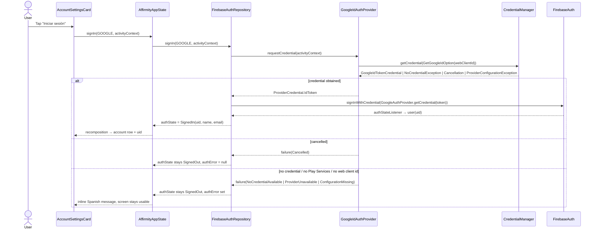

# Design: Firebase Authentication (stage 1 of 3)

## Technical Approach

New `auth/` package (sibling of `notifications/`, `widget/`) holding a provider-agnostic
`AuthRepository` + a pluggable `AuthProvider` credential collector. `FirebaseAuthRepository`
mirrors `FirebaseAuth.addAuthStateListener` into a `StateFlow<AuthState>`; `GoogleIdAuthProvider`
collects a Google ID token through Credential Manager. Both are hand-wired in
`rememberAffirmityAppState()` (no DI framework) and exposed additively on `AffirmityAppState`.
UI is one new stateless `AccountSettingsCard` composable added as a `LazyColumn` item in the
existing `SettingsScreen.kt` — Settings-only, optional, never a first-run gate.
Satisfies `specs/user-auth/spec.md`.

## Architecture Decisions

| Decision | Choice | Alternatives rejected | Rationale |
|---|---|---|---|
| Auth API shape | `signIn(provider: AuthProviderId, activityContext)` + separate `AuthProvider` impl per provider | `signInWithGoogle()` (as loosely named in the spec) | Apple is a real future plan (iOS/web client). Google-named methods would break spec Requirement "Provider-Agnostic Auth Contract" and force a public-API rewrite later. Adding Apple = one new `AuthProvider` + one `ProviderCredential` branch. |
| Package location | `com.pirxhio.affirmity.auth` | inside `data/`, or `data/remote/` | Matches the existing feature-package layering (`notifications/`, `widget/`); `data/` is Room/DataStore-shaped today. |
| Composition wiring | Additive non-null `authRepository` constructor param + `authState`/`authError` Compose state | Global singleton; Hilt | One repository does not justify a DI framework; `rememberAffirmityAppState()` is the established single composition root. |
| Activity context | Passed per call (`signIn(..., activityContext)`) from `LocalContext.current` at the call site | Store the Activity in the repository/app state | Credential Manager needs an Activity context, but the remembered app state must not retain one. |
| Web client ID source | `default_web_client_id` string resource generated by the `google-services` plugin, resolved **by name** at runtime | Hardcoded constant; manual `strings.xml`; `buildConfigField` | No secret in source, no manual step after console setup. Name-based lookup avoids a compile-time break when the JSON has no web OAuth client, and degrades to a handled UI state. |
| Google credential API | `CredentialManager` + `GetGoogleIdOption` (`googleid`) + `credentials-play-services-auth` | Deprecated `GoogleSignInClient` | `GoogleSignInClient` is deprecated in 2026; Credential Manager supports minSdk 24. |
| `google-services.json` | **Committed** to `app/` (adopted decision) | gitignore + checked-in template | Google documents it as non-secret; protection comes from SHA fingerprints and (stage 2) Firestore rules. Gitignoring breaks clean clones and CI builds because the plugin fails without it. |
| Firebase init | Default `google-services` auto-init | Explicit init in `AffirmityApplication` | Zero change to the WorkManager-bearing Application class. |

Non-obvious resource lookup (fails soft instead of failing the build):

```kotlin
internal fun webClientId(context: Context): String? =
    context.resources
        .getIdentifier("default_web_client_id", "string", context.packageName)
        .takeIf { it != 0 }
        ?.let(context::getString)
        ?.takeIf { it.isNotBlank() }
```

## Interfaces / Contracts

```kotlin
enum class AuthProviderId { GOOGLE } // APPLE later

sealed interface AuthState {
    data object SignedOut : AuthState
    data class SignedIn(val uid: String, val displayName: String?, val email: String?) : AuthState
}

/** Provider-neutral credential shapes; Apple later adds an OAuth web-flow branch. */
sealed interface ProviderCredential {
    data class IdToken(val providerId: String, val token: String) : ProviderCredential
}

sealed interface AuthError {
    data object NoCredentialAvailable : AuthError   // no Google account on device
    data object ProviderUnavailable : AuthError     // Play Services missing/outdated
    data object ConfigurationMissing : AuthError    // no web client id
    data class Unknown(val message: String?) : AuthError
}

interface AuthProvider {
    val id: AuthProviderId
    suspend fun requestCredential(activityContext: Context): Result<ProviderCredential>
}

interface AuthRepository {
    val authState: StateFlow<AuthState>
    suspend fun signIn(provider: AuthProviderId, activityContext: Context): Result<Unit>
    suspend fun signOut()
}
```

`FirebaseAuthRepository(auth, providers: Map<AuthProviderId, AuthProvider>)` maps
`ProviderCredential.IdToken` → `GoogleAuthProvider.getCredential(token, null)` →
`signInWithCredential`. Cancellation is **not** an error: it resolves to `SignedOut`, no message.

## Data Flow



## File Changes

| File | Action | Description |
|---|---|---|
| `gradle/libs.versions.toml` | Modify | Firebase BOM, `firebase-auth`, `androidx.credentials(-play-services-auth)`, `googleid`, `google-services` plugin (catalog only) |
| root `build.gradle.kts`, `app/build.gradle.kts` | Modify | Apply `google-services` plugin, add deps |
| `app/google-services.json` | Create (committed) | Console-generated config |
| `auth/AuthState.kt`, `auth/AuthRepository.kt`, `auth/AuthProvider.kt` | Create | Provider-agnostic contract + models |
| `auth/FirebaseAuthRepository.kt` | Create | Firebase adapter, listener→`StateFlow`, credential mapping |
| `auth/GoogleIdAuthProvider.kt` | Create | Credential Manager + `GetGoogleIdOption`, error classification, `webClientId()` |
| `data/AffirmityAppState.kt` | Modify | Additive `authRepository` param, `authState`/`authError` state, `signIn`/`signOut`; wire in `rememberAffirmityAppState()` |
| `ui/settings/AccountSettingsCard.kt` | Create | Stateless card (state + callbacks), matching `ChannelSettingsCard` style |
| `ui/settings/SettingsScreen.kt` | Modify | New `item { AccountSettingsCard(...) }` + params |
| `MainActivity.kt` | Modify | Pass auth state/callbacks with call-site `LocalContext.current` |
| `res/values/strings.xml` | Modify | Spanish account/error copy |
| `app/src/test/.../auth/` | Create | Unit tests (TDD, `tdd: true`) |

## Testing Strategy

| Layer | What to test | Approach |
|---|---|---|
| Unit (`testDebugUnitTest`) | `FirebaseAuthRepository` state mapping (user→`SignedIn`, null→`SignedOut`), error classification (cancel vs. no-credential vs. provider-unavailable vs. config-missing), `signIn` on unregistered provider | Fake `AuthProvider` + fake auth source behind a narrow internal seam; JUnit 4, no Firebase/Android deps in the mapping code |
| Integration | N/A (`config.yaml`: unavailable) | — |
| E2E (`connectedDebugAndroidTest`) | Signed-out Settings renders sign-in row; existing screens unaffected | Compose UI test with a fake repository; the real Credential Manager sheet is verified manually against the console (proposal success criteria) |

## Threat Matrix

N/A — no routing, shell, subprocess, VCS/PR automation, executable-file classification, or
process-integration boundary. (Credential handling is delegated to Credential Manager and
Firebase Auth; no token is persisted by app code.)

## Migration / Rollout

No data migration: Room/DataStore/WorkManager untouched and the UID is read by nothing.
Ship on a feature branch until `app/google-services.json` and the SHA-1/SHA-256 fingerprints
exist, otherwise the plugin fails the build. Rollback per the proposal (revert branch, or drop
the Settings card leaving the repository inert).

## Open Questions

- [ ] Spec text names `authRepository.signInWithGoogle()`; this design uses
      `signIn(AuthProviderId.GOOGLE, ...)` to satisfy the same spec's provider-agnostic
      requirement. `sdd-tasks` should carry the provider-agnostic signature; the spec wording
      is superseded, not contradicted in behavior.
- [ ] Confirm the Firebase console OAuth setup produces a type-3 (web) client so
      `default_web_client_id` is generated — otherwise sign-in surfaces
      `ConfigurationMissing` (handled, not a crash).
